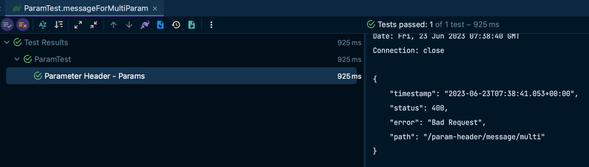

Spring의 @RequestMapping

Spring MVC의 annotation 중 하나인 @RequestMapping과 그 외의 관련된 annotation들을 살펴보려고 합니다.
# 1. @RequestMapping
***
## value, method 속성
```java
@RequestMapping(value = "/ex/foos", method = GET)
@ResponseBody
public ResponseEntity<String> getFoosBySimplePath() {
    return ResponseEntity.ok().body("foos");
}
```
이 기능을 테스트하려면 아래 command를 실행해야 합니다.
>curl -i http://localhost:8080/ex/foos

위의 예제에서 @RequestMapping은 value와 method 속성를 사용하고 있습니다.
value는 요청을 처리할 URI를 나타내고, method는 요청을 처리할 HTTP method를 나타냅니다.

method 속성은 default 값이 존재하지 않으며, 때문에 값을 명시하지 않으면 모든 HTTP method를 처리합니다.

```java
@RequestMapping(value = "/ex/foos")
    @ResponseBody
    public ResponseEntity<String> getFoosBySimplePath() {
        return ResponseEntity.ok().body("foos");
    }
```

이렇게 method속성을 정의하지 않은 상태에서

```java
    /**
     * HttpMethodController > getFoosBySimplePath 메서드
     */
    @DisplayName("requestMapping의 method 속성을 정의하지 않으면 모든 HTTP 메서드에 대해 처리한다.")
    @Test
    void notDefinedMethod() {
        RestAssured.given().log().all()
                .contentType(MediaType.APPLICATION_JSON_VALUE)
                .when().get("/http-method/users/ex/foos")
                .then().log().all()
                .statusCode(HttpStatus.OK.value());

        RestAssured.given().log().all()
                .contentType(MediaType.APPLICATION_JSON_VALUE)
                .when().post("/http-method/users/ex/foos")
                .then().log().all()
                .statusCode(HttpStatus.OK.value());
    }
```
같은 URI에 대해 GET, POST 모두 처리합니다.


## headers
```java
@RequestMapping(value = "/ex/foos", headers = "key=val", method = GET)
@ResponseBody
public String getFoosWithHeader() {
    return "Get some Foos with Header";
}
```
이 매핑을 테스트하려면 아래 command를 실행해야 합니다.

>curl -i -H "key:val" http://localhost:8080/ex/foos

위의 예제에서 @RequestMapping은 headers를 가지고 있습니다.
headers는 요청을 처리할 HTTP header를 나타냅니다.
headers는 배열로도 표현할 수 있습니다.

```java
@RequestMapping(
        value = "/ex/headers", 
        headers = { "key1=val1", "key2=val2" },
        method = GET)
@ResponseBody
public ResponseEntity<String> getFoosWithHeaders() {
    return ResponseEntity.ok().body("headers");
}
```

위처럼 header 혹은 headers를 정의하게 되면, 해당 header가 존재해야만 해당 요청을 처리합니다.
```java

/**
 * HttpMethodController > getFoosWithHeaders 메서드
 */
@DisplayName("header값을 정확히 입력해주면 조건에 부합하는 기능에 매핑해준다")
@Test
    void headerMapping() {
            RestAssured.given().headers("key1", "val1", "key2", "val2")
            .log().all()
            .when().get("/http-method/users/ex/headers")
            .then()
            .log().all()
            .statusCode(HttpStatus.OK.value());
            }

/**
 * HttpMethodController > getFoosWithHeaders 메서드
 */
@DisplayName("header값을 정확히 입력해주지않으면 매핑해주지 않는다.")
@Test
    void headerMappingNotFound() {
            RestAssured.given().headers("key1", "val1", "key2", "val1")
            .log().all()
            .when().get("/http-method/users/ex/headers")
            .then()
            .log().all()
            .statusCode(HttpStatus.NOT_FOUND.value());
            }
```
다음과 같이 하나는 @RequestMapping에서 정의한 header값을 입력하고, 하나는 정의하지 않은 header값을 입력하면

다음과 같이 정확히 header값을 입력한 경우에만 매핑해줍니다.

## produces, consumes

Spring 3.1부터 @RequestMapping은 다음과 같은 특성을 생성하고 사용합니다

```java
@PostMapping(value = "/users", consumes = "application/json")
public ResponseEntity createUser(@RequestBody User user) {
    Long id = 1L;
    return ResponseEntity.created(URI.create("/users/" + id)).build();
}

@GetMapping(value = "/users", produces = "application/json")
public ResponseEntity<List<User>> showUser() {
    List<User> users = Arrays.asList(new User("이름", "email"),new User("이름", "email"));
    return ResponseEntity.ok().body(users);
}
@GetMapping(value = "/users", produces = "text/html")
public String userPage() {
    return "user page";
}
```

produces속성과 consumes속성은 HTTP header인 Accept와 Content-Type을 나타냅니다.
produces은 client가 server에게 특정 형식을 요청하는 Accept header를 나타냅니다.
consumes는 client가 server에게 보내는 contents의 Content-Type header를 나타냅니다.

테스트를 해보면

```java
    /**
     * MediaTypeController > createUser 메서드
     * > consumes 값으로 APPLICATION_JSON_VALUE 받기
     */
    @DisplayName("Media Type - Content-Type")
    @Test
    void createUser() {
        User user = new User("이름", "email@email.com");

        RestAssured.given().log().all()
                .contentType(MediaType.APPLICATION_JSON_VALUE)
                .body(user)
                .when().post("/media-type/users")
                .then().log().all()
                .statusCode(HttpStatus.CREATED.value())
                .header("Location", "/users/1");
    }

    /**
     * MediaTypeController > showUser 메서드
     * MediaTypeController > userPage 메서드
     *
     * > produces 값으로 요청 구분하기
     * > APPLICATION_JSON_VALUE와 TEXT_HTML_VALUE 각각 처리하기
     */
    @DisplayName("Media Type - Accept")
    @Test
    void showUser() {
        RestAssured.given().log().all()
                .accept(MediaType.TEXT_HTML_VALUE)
                .when().get("/media-type/users")
                .then().log().all()
                .statusCode(HttpStatus.OK.value())
                .contentType(MediaType.TEXT_HTML_VALUE)
                .body(containsString("user page"));

        RestAssured.given().log().all()
                .accept(MediaType.APPLICATION_JSON_VALUE)
                .when().get("/media-type/users")
                .then().log().all()
                .statusCode(HttpStatus.OK.value())
                .contentType(MediaType.APPLICATION_JSON_VALUE)
                .body("size()", is(2));
    }
```

다음과 같이 잘 매핑되는 것을 볼 수 있습니다.

# 2. @RequestMapping with @PathVariables
***
URI의 일부를 @PathVariable을 이용하여 변수에 바인딩할 수 있습니다.

## @PathVariable
```java
@GetMapping("/users/{id}")
public ResponseEntity<User> pathVariable(@PathVariable long id) {
    User user = new User(id, "이름", "email");
    return ResponseEntity.ok().body(user);
}
```

메서드 매개 변수의 이름이 경로 변수의 이름과 정확히 일치하는 경우 값이 없는 @PathVariable을 사용하여 이 작업을 단순화할 수 있습니다:

method의 parameter의 이름과 uri의 path variable의 이름이 같다면 @PathVariable의 value설정을 생략할 수 있습니다.

```java
@RequestMapping(value = "/ex/foos/{id}", method = GET)
@ResponseBody
public String getFoosBySimplePathWithPathVariable(
  @PathVariable String id) {
    return "Get a specific Foo with id=" + id;
}
```

해당 기능이 정상작동하는가에 대한 테스트는 다음과 같습니다.

```java
    /**
     * UriPatternController > pathVariable 메서드
     */
    @DisplayName("Uri Pattern - @PathVariable")
    @Test
    void pathVariable() {
        RestAssured.given().log().all()
                .accept(MediaType.APPLICATION_JSON_VALUE)
                .when().get("/uri-pattern/users/1")
                .then().log().all()
                .statusCode(HttpStatus.OK.value())
                .body("id", notNullValue())
                .body("name", notNullValue())
                .body("email", notNullValue());
    }
```

잘 호출되는 것을 확인할 수 있습니다.

## Multiple @PathVariable

@PathVariable은 여러개 사용할 수 있습니다.
```java
@RequestMapping(value = "/ex/foos/{fooid}/bar/{barid}", method = GET)
@ResponseBody
public String getFoosBySimplePathWithPathVariables
  (@PathVariable long fooid, @PathVariable long barid) {
    return "Get a specific Bar with id=" + barid + 
      " from a Foo with id=" + fooid;
}
```

## @PathVariable With Regex

@PathVariable은 정규식을 사용할 수 있습니다.

```java
@GetMapping("/patterns/{path:[a-z]}")
public ResponseEntity<String> pattern(@PathVariable String path) {
    return ResponseEntity.ok().body("pattern");
}
```

다음과 같이 사용하여 path variable의 형식을 제한할 수 있습니다.

```java
    @DisplayName("Uri Pattern - pattern")
    @Test
    void pattern() {
        RestAssured.given().log().all()
                .accept(MediaType.APPLICATION_JSON_VALUE)
                .when().get("/uri-pattern/patterns/a")
                .then().log().all()
                .statusCode(HttpStatus.OK.value())
                .body(is("pattern"));

        RestAssured.given().log().all()
                .accept(MediaType.APPLICATION_JSON_VALUE)
                .when().get("/uri-pattern/patterns/b")
                .then().log().all()
                .statusCode(HttpStatus.OK.value())
                .body(is("pattern"));
    }
```
다음과 같이 테스트를 돌렸을 때


정상 작동하는 것을 확인할 수 있습니다.

# 3. @RequestMapping with Request Parameters
***

@RequestMapping은 url parameter를 @RequestParam을 이용하여 쉽게 매핑할 수 있도록 해줍니다.
## @RequestParam
```java
@RequestMapping(value = "/ex/bars", method = GET)
@ResponseBody
public String getBarBySimplePathWithRequestParam(
  @RequestParam("id") long id) {
    return "Get a specific Bar with id=" + id;
}
```

이 매핑을 테스트하려면 아래 command를 실행해야 합니다.
> curl -i -d id=100 http://localhost:8080/spring-rest/ex/bars

## RequestMapping define Request Parameters
@RequestMapping은 request parameter를 정의할 수 있습니다.

```java
@GetMapping(params = "name")
public ResponseEntity<String> messageForParam() {
    return ResponseEntity.ok().body("hello");
}
```
해당 정의를 통해 파라미터에 대한 매핑을 좀 더 명확하게 할 수 있습니다.

```java
    @DisplayName("Parameter Header - Params")
    @Test
    void messageForParam() {
        RestAssured.given().log().all()
                .accept(MediaType.APPLICATION_JSON_VALUE)
                .when().get("/param-header/message?name=hello")
                .then().log().all()
                .statusCode(HttpStatus.OK.value())
                .body(is("hello"));
    }
```


또한 값을 지정하거나, 복수로 사용할 수도 있습니다.
```java
@GetMapping(value = "/multi", params = {"name=hello", "message"})
public ResponseEntity<String> messageForMultiParam(@RequestParam String name) {
    return ResponseEntity.ok().body("hello message");
}
```
유저는 params로 명시된 값들을 정확하게 일치시켜야 해당 기능을 사용할 수 있고, reqeustParam을 통해 모든 값을 사용할 필요는 없습니다.

```java
    @DisplayName("Parameter Header - Params")
    @Test
    void messageForMultiParam() {
        RestAssured.given().log().all()
                .accept(MediaType.APPLICATION_JSON_VALUE)
                .when().get("/param-header/message/multi?name=hello&message=something")
                .then().log().all()
                .statusCode(HttpStatus.OK.value())
                .body(is("hello message"));

        RestAssured.given().log().all()
                .accept(MediaType.APPLICATION_JSON_VALUE)
                .when().get("/param-header/message/multi?name=hello")
                .then().log().all()
                .statusCode(HttpStatus.BAD_REQUEST.value());
    }
```



# @RequestMapping Corner Cases
***

## @RequestMapping with Multiple Paths or HTTP Methods
```java
@RequestMapping(
    value = { "/ex/advanced/bars", "/ex/advanced/foos" },
    method = GET)
@ResponseBody
public String getFoosOrBarsByPath() {
    return "Advanced - Get some Foos or Bars";
}

@RequestMapping(
  value = "/ex/foos/multiple", 
  method = { RequestMethod.PUT, RequestMethod.POST }
)
@ResponseBody
public String putAndPostFoos() {
    return "Advanced - PUT and POST within single method";
}
```

## Mapping Error Cases

### Ambiguous Mapping
HTTP 메서드, URL, 매개 변수, 헤더 및 미디어 유형이 동일한 경우 에러가 발생합니다.

```java
@GetMapping(value = "/foos/duplicate" )
public String duplicate() {
    return "Duplicate";
}

@GetMapping(value = "/foos/duplicate" )
public String duplicateEx() {
    return "Duplicate";
}
```

이 경우에 에러가 발생합니다.
>Caused by: java.lang.IllegalStateException: Ambiguous mapping.


클래스 단위에서 requestMapping으로 value를 정하고, 메서드 단위에서 value나 method type을 지정해주지 않으면 uri에 바인딩 되지 않습니다.

```java
@RequestMapping("/http-method/users")
public class HttpMethodController {

    public ResponseEntity createUser(@RequestBody User user) {
        Long id = 1L;
        return ResponseEntity.created(URI.create("/users/" + id)).build();
    }

    public ResponseEntity<List<User>> showUser() {
        List<User> users = Arrays.asList(
                new User("이름", "email"),
                new User("이름", "email")
        );
        return ResponseEntity.ok().body(users);
    }

}
```

```java
@DisplayName("Http Method - POST")
    @Test
    void createUser() {
        User user = new User("이름", "email@email.com");

        RestAssured.given().log().all()
                .contentType(MediaType.APPLICATION_JSON_VALUE)
                .body(user)
                .when().post("/http-method/users")
                .then().log().all()
                .statusCode(HttpStatus.CREATED.value())
                .header("Location", "/users/1");
    }
```

